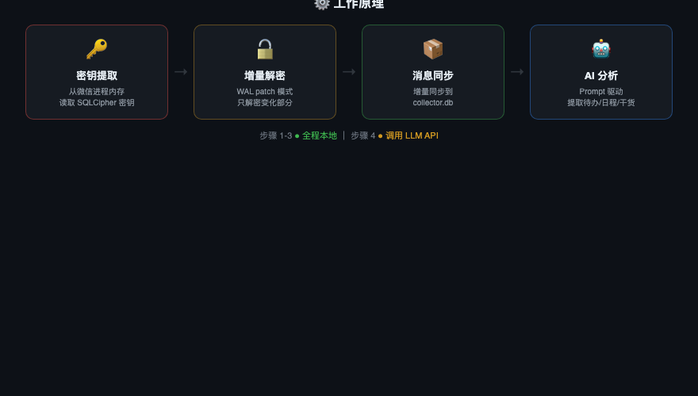

<p align="center">
  <b>Hermes Skill</b> — 微信 AI 个人助手，自动从微信聊天中提取待办、日程、干货、热点、技术讨论，推送到飞书。
  <br>macOS 14/15 + 微信 4.0+ + Python 3.9/3.13 验证通过
</p>

---

## 功能

6 个独立 cron 任务，全自动运行：

| 任务 | 频率 | 说明 |
|------|------|------|
| 待办扫描 | 每 30 分钟 | 从私聊提取待办事项，状态追踪（open → done → 归档） |
| 日程扫描 | 每 30 分钟 | 提取日程约定，状态追踪（pending → confirmed → expired） |
| 干货收集 | 每天 9:00 | 从群聊提取有价值内容，按天存档 |
| 热点扫描 | 每小时 | 跨群话题关联发现，今日累计模式（越晚越准） |
| 技术讨论 | 每天 10:30 | 提取技术讨论精华，按分类归档 |
| 偏好画像 | 每天 23:00 | 从用户自己发的消息中分析技术/商业/决策/写作偏好 |

另外还有 3 个低频洞察任务（热点日汇总 21:00、洞察分析 每3天、偏好扫描 每天）。

---

## 工作原理

<p align="center">
  
</p>

**两层设计**：

1. **CLI 层**（`scripts/`）：纯 Python，从微信本地加密数据库增量解密 → 提取结构化 JSON。不调 AI API。
2. **Agent 层**（`prompts/`）：Hermes cron 读 prompt 模板，调 CLI 拿 JSON，LLM 分析后推送到飞书。

想改分析逻辑？改 `prompts/*.md`，不用动代码。

---

## 数据流

```
微信进程 → 加密 DB + WAL（持续写入）
     ↓ refresh_decrypt.py（增量 WAL patch，~70ms）
解密后 DB
     ↓ collector.py --sync（增量同步）
collector.db
     ↓ extract_*.py（读 scan_state.json → 输出 JSON + 已有状态）
Hermes cron（LLM 分析 → 去重 → 更新状态 → 推飞书 → 写 assistant.db）
```

---

## 快速开始

### 环境要求

- **macOS 13+**（ARM64 或 Intel）
- **微信桌面版 4.0+** 正在运行
- **Python 3.8+** + `pip3 install pycryptodome zstandard pyyaml`
- **[Hermes Agent](https://github.com/nousresearch/hermes)** 已安装并配置飞书

### 安装

```bash
# 1. 克隆到 Hermes skills 目录
git clone https://github.com/huangserva/wechat-assistant.git ~/.hermes/skills/social-media/wechat-assistant

# 2. 安装依赖
pip3 install pycryptodome zstandard pyyaml

# 3. 编译密钥提取工具
cd ~/.hermes/skills/social-media/wechat-assistant/scripts/decrypt
cc -O2 -o find_all_keys_macos find_all_keys_macos.c
```

### 设置

跟 Hermes 说 `帮我设置微信助手`，Agent 会自动引导：

1. 创建工作目录（建议 `~/wechat-assistant`）
2. 提取微信数据库密钥（需要 sudo）
3. 创建 config.yaml
4. 首次解密 + 同步
5. 配置飞书推送
6. 注册 cron 任务

全程跟着 Agent 走就行。

---

## 热点提取机制

`extract_trending.py` 经过三层处理，避免泛化大类词（如 "Claude"、"AI"）淹没具体话题：

1. **Token + Bigram 提取**：提取单词和相邻词组合（如 `claude mythos`、`plus 代充`）
2. **泛化词过滤**：25+ 个大类词（claude/gpt/ai/cursor 等）作为单 token 被过滤，但 bigram 形式保留（`claude mythos` 不被过滤）
3. **LLM 话题归纳**：prompt 指示 LLM 把相关 keyword 归纳为具体事件标题，跨群门槛 3+

---

## 文件结构

```
scripts/
  decrypt/
    find_all_keys_macos.c     — 从微信进程内存提取密钥（C，需 sudo）
    decrypt_db.py              — 全量解密（首次用）
    config.py                  — YAML 配置加载
  state_manager.py             — 统一状态管理（scan_state.json 读写）
  db_writer.py                 — assistant.db 写入工具（9 张表）
  refresh_decrypt.py           — 增量解密（WAL patch，cron 用这个）
  collector.py                 — 消息同步到 collector.db
  extract_todos.py             — 私聊待办 → JSON
  extract_calendar.py          — 日程 → JSON
  extract_digest.py            — 群聊干货 → JSON
  extract_trending.py          — 跨群热点 → JSON
  extract_tech.py              — 技术讨论 → JSON
  extract_preferences.py       — 用户偏好/写作样本 → JSON
  insight.py                   — 多天 digest 合并分析
  requirements.txt
prompts/
  todo-scan.md                 — 待办扫描 prompt
  calendar-scan.md             — 日程扫描 prompt
  digest.md                    — 干货收集 prompt
  trending-scan.md             — 热点扫描 prompt（每小时）
  trending-daily.md            — 热点日汇总 prompt
  tech-scan.md                 — 技术讨论 prompt
  insight.md                   — 洞察分析 prompt
  preference-scan.md           — 偏好画像 prompt
config.example.yaml
SKILL.md                       — Agent 读这个
```

---

## 隐私

数据提取（解密、同步、JSON 输出）全程本地运行。AI 分析阶段，提取后的聊天摘要会发送到你配置的大模型 API。原始加密数据库不会离开本机。

---

## 致谢

核心解密逻辑基于 [bbingz/wechat-decrypt](https://github.com/bbingz/wechat-decrypt/tree/feat/macos-support)（进程内存密钥提取、SQLCipher 4 解密、WAL 增量 patch）。

## License

MIT
